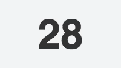

# [React Number Easing](http://javierbyte.github.io/react-number-easing/)

React component for fancy number transitions.

[Live demo](http://javierbyte.github.io/react-number-easing/)

## Installation

    npm install react-number-easing --save

## Usage.

    var NumberEasing = require('react-number-easing');

    <NumberEasing
		value={15}
		speed={300}
		ease='quintInOut'/>

### Props

* `value`: The value that you want to display at the end of the animation.
* `[speed]`: How fast do you want to finish the animation? Defaults to 500ms.
* `[useLocaleString]`: Should use `toLocaleString()`?
* `[ease]`: The easing equation for the animation. Defaults to `quintInOut`. You can choose from [mattdesl/eases](https://github.com/mattdesl/eases/blob/master/index.js).

# Build

If you want to build this from source, you will need babel and less.

	npm install -g babel less

And run the pre publish script

	npm run prepublish
